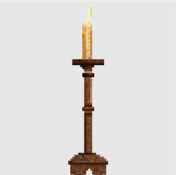
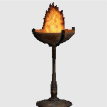
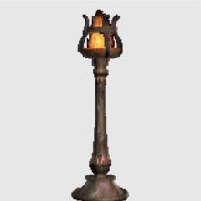
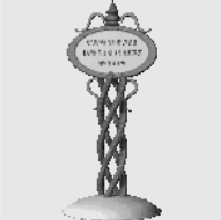
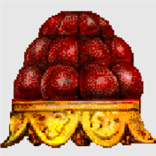
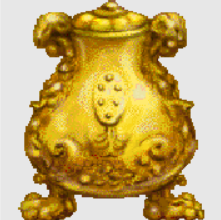
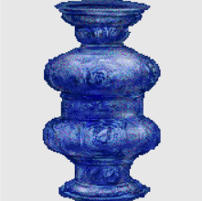
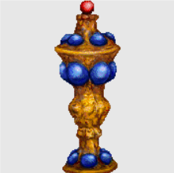

# Meridian 59 Administration Commands
:heavy_exclamation_mark: Use at your own risk :heavy_exclamation_mark:

Contributions / PRs are welcome!
### Administration Methods

There are 5 ways to run admin commands in Meridian 59
1. the normal client text window area
2. the client administration console (shift+4)
3. the server administration console on the server itself (Windows only - not on Linux)
4. the maintenance port
5. using the 'load' command to run admin commands from a text file that the server reads in


#### The Client Administration Console (shift+4)

Open the Client Administration Console using `shift+4` \
You must be logged on as an admin to do so.


### Commands

There are 3 levels of commands
- `Player`
- `DM`
- `Admin`


### Key .kod files to check
- `admin.kod`
- `dm.kod`
- `system.kod`

### DM Commands

|Command|Notes|
|:-|:-|
`go <room string>` | you can use go 50 (using the id directly) instead of needing to use the rid strings
`getplayer <playername>` | bring a player to you - use in normal command bar.  Note: they must have gone through the Raza portal
`goplayer <player name>` | go to a player - normal command bar

### Example: Creating an Object and Moving it
`create object sign`\
OUTPUT: `Created object 6162.`

`show object 6162`\
OUTPUT:
```
:< OBJECT 6162 is CLASS Sign
: self                 = OBJECT 6162
: poOwner              = $ 0
: vrName               = RESOURCE sign_name_rsc
: vrIcon               = RESOURCE sign_icon_rsc
: vrDesc               = RESOURCE sign_desc_rsc
: vrInsc               = RESOURCE sign_insc_rsc
:>
```

Note `poOwner` is set to 0
we need to move it to our current room

check your own room by checking the owner


In this case the room object we are in is `2005`

Make the room the owner of the object\
`send object (object of what room you are in) newhold what object (what you just made)`\
`send object 2005 newhold what object 6162`\
OUTPUT:
```
:< return from OBJECT 2005 MESSAGE NewHold (10022)
: $ 0
:>
```

Null output, no errors means it worked.\
`show object 6162` in the admin console
click on "move" to bring up the admin move object dialog


Move it to xy 21 42 in Raza to move it near the blink spot for example\
You can also do this via a command\
`send object 2005 somethingmoved what object 6162 new_row int 20 new_col int 20 fine_row int 32 fine_col int 32`


### Common Issues

> I changed loot tables, but the loot hasn't changed.  For testing purposes, I decided to do something obvious and make the giant rats drop Mystic Swords.  I changed the TID_RAT table (rattres.kod) to the following:
```
   constructed()
   {
      plTreasure = [  [ &MysticSword, 100 ] ];

      propagate;
   }
```
> When I kill giant rats, they still drop herbs, mushrooms, etc, but no Mystic Swords.  Is there something obvious I'm missing? 

Solution
- Rebuild the Blakod and then tell the server to load the new compiled code
- Treasure type objects are created once and stored, so you also need to recreate them: 
`send object 0 RecreateAllTreasureTypes` from admin mode

### Create Lighting
|Command|Graphic|Description
|:-|:-:|:-|
`dm place candle`||A beeswax candle burns brightly.
`dm place candelabra`|| An ornate brass five-candle stand.  The candles are flickering softly.
`dm place brazier`||The flame burns bright, offering welcome light to the surroundings.
`dm place lamp`||These lamps stand like silent sentinels.
`dm place firepit`||This small fire offers both light and warmth to the surrounding area.
`dm place dynamic light` | | You are looking at an object

Tip: edit object properties to set `pbIsLit` and `piLightIntensity` as needed
### Create Event Items - Totems, Signs, Relics
|Command&nbsp;&nbsp;&nbsp; |Graphic|Description|
|:-|:-:|:-|
`dm totem`| | This feathered totem is oft the objective of quests set upon mortals by the Bards of the world of Meridian.<br><br>The totem must be held when in possession, and is dropped when removed from use.
`dm event sign`|| Creates a generic event sign
`dm relic 1`|| This decorative piece of art was created for King Zarcos the 4th to be given to his wife on their wedding day.  Later, when Queen Joline was convicted of treason and exiled, the king ordered the heirloom destroyed because it reminded him of her. Apparently, the orders were not completely carried out.<br><br>Being one of a kind, this heirloom can not be carried in one's possession for very long or tucked away in a chest.|
`dm relic 2`|| Excavated during the construction of the palace of the dark Princess Venya'cyr, the Urn came quickly into her possession as a valued treasure.  Ancient rumors suggest the Urn is cursed.  The craftsmanship of this priceless relic comes from unknown origins, certainly predating the Meridian settlers.  An unusual presence prevents this object from being stored in a chest or held for very long.|
`dm relic 3`|| Antiquarians claim there only to be a few of the priceless Minjaka Vases left in existence.  These exquisitely mastered vases use to line the throne room of Castle Victoria during the Minjakan dynasty of explorers in the second century.<br><br>Being one of a kind, this vase can not be carried in one's possession for very long or tucked away in a chest.|
`dm relic 4`|| Thought to be an artifact from the Empire of the Nexus before this land was even discovered, this ancient shield is too old and valuable to be used in combat.<br><br>Being one of a kind, this shield can not be carried in one's possession for very long or tucked away in a chest.|
`dm relic 5`|| Fabricated in the 5th century, this one of a kind heirloom was meant to be delivered as a gift to the Emperor of the old land.  Before the couriers could set out, the Nexus snapped, destroying any possible route to the empire.  The Chalice was lost for centuries, thought to be absconded with by thieves.<br><br>Being one of a kind, this Chalice can not be carried in one's possession for very long or tucked away in a chest.|
### Change Server Time
|Command|Icon|
|:-|:-|
`dm morning`| :sunrise:	
`dm afternoon`|:sun_with_face:	
`dm evening`|:city_sunset:	
`dm night`|:first_quarter_moon_with_face:	
`dm restore time`|:hammer_and_wrench:	
### DM Disguises
|Command|Graphic|Notes|
|:-|:-|:-|
`dm disguise <name>`| | checks art archive, then NPCs, then monsters
`dm anonymous`| |Removes the name from your character, but still appears in who list. Repeat the command to restore your name.
`dm shadow`|  | shadowform
`dm stealth on` | | You are now in stealth mode.
`dm stealth off`| | 
`dm hidden` | | You are hidden from mortal eyes.  This will make it appear as if you have logged off in the "who" list.  It also prevents the watcher or Goad from greeting a hidden admin or DM.
`dm blank` | | You are now blank.
`dm human` | | change back to human state
`dm plain` | | change back to normal form
### Create Monsters
|Command|Notes|
|:-|:-|
`dm monster <monstername>` | Example: "dm monster ant"
### Configure Logoff Ghosts and Penalties
|Command|Notes|
|:-|:-|
`dm logoffghost on` | Logoff penalties are now active.
`dm logoffghost off` | Logoff penalties are now inactive.
`dm logoffghost temp off` | Logoff penalties are now temporarily inactive.

### Set Karma
|Command|Notes|
|:-|:-|
`dm good` | set karma +100
`dm evil` | set karma -100
`dm neutral` | set karma 0

### Actions
|Command|Notes|
|:-|:-|
`dm rumble `| shakes the screen in the area for 500 ms (1/2 second)  If you want to shake the room for longer you can use the `rumble` message/function and send it to the room object like this `send object <room object #> rumble duration int 5000` To change the duration adjust the value of 5000
`dm create item attribute <attributenamehere>` | You need to equip the weapon you wish to give an attribute to.  This command only works on weapons.
`dm mortal` | (fun fact, you can do "s mortal" as well. was sloppily done)
`dm immortal` | (same as above)
`dm appeal off` | You will now hear appeals.
`dm appeal on` | You will no longer hear appeals.
`dm guest appeal off` | You will no longer hear guest appeals. (probably defunct)
`dm guest appeal on` | You will now hear guest appeals. (same)
`dm clear abilities`
`dm clear inventory`
`dm get money` | creates 500,000 shillings
`dm pk enable` | makes you attackable "You suddenly feel more vulnerable."
`dm pk disable` | makes you un-attackable
`dm monster budget` | checks what monster creation limits (if any) you have 
`dm monster authorize` | (???)
`dm none` | (???)
`dm pk lock` | (cannot attack/be attacked I think)
`dm pk unlock` | (removes pk lock)
`dm call monster` | (unsure?  does it force room spawns?)
`dm human` | (same as above I think?)
`dm disguise ant` | (or other monster name)
`dm get items` 
`dm get` | misc, gems reagents food weapons armor ammo wands rings sundries games necklaces potions scrolls wands masks
`dm testexitpoints` | test the map exit points in a room
`dm testmonstergenpoints` | test the monster generation points in a room
`dm testitempoints` | test the item generation points in a room


---

Go to a specific room\
`go <room string>`\
Example: `go rid_tos`

The room string value is from `blakston.khd`\
example: `RID_TOS = 50`

`RID_TOS` is the room string value to use with the `go` command\
`50` is the equivalent room id (RID) used in other commands

Note: You can alternatively use `go 50` (using the room id directly) instead of using the rid strings


Check [blakston.khd](https://github.com/Meridian59/Meridian59/blob/b22dceea862f85cc53772d93ffd815329da11b62/kod/include/blakston.khd#L359) for room values from the official Meridian 59 repository.

---

Send an object to a specific room id\
`send object <object number> teleportto rid int <room id>`\
Check [blakston.khd](https://github.com/Meridian59/Meridian59/blob/b22dceea862f85cc53772d93ffd815329da11b62/kod/include/blakston.khd#L359) for the room id (RID) values from the official Meridian 59 repository.


---

admin command reference\
`kod\object\active\holder\nomoveon\battler\player\user\dm\admin.kod`

### Get more information about Blakod message (i.e. function)
`show message [class] [message]`\
Example: `show message item IsCursed`\
Output: `This returns TRUE if a RemoveCurse spell should unuse the item.  Since an ItemAtt can curse an item, go through those to check.`\

Start tour of all rooms\
`dm start tour`

Stop tour\
`dm end tour`

Populate map of current room\
`show map`


---

Get spells or skills\
`dm get spells`\
`dm get skills`

---

Boost stats\
`dm boost stats`

---

Room Monster Rates\
Mob spawns have 3 controls

   `piMonster_count_max` = 30 \
    `piInit_count_min` = 5 \
    `piInit_count_max` = 10
    
This means the room will have 5-10 mobs when u user enters it and will spawn up to 30

---

Refresh the state of an object\
`send object [object id] somethingchanged`

---

## Changing Server Settings
Change max room rental length\
`show object 0` (server settings)

look for `poRentableRoomMaintenance` = OBJECT 3504 (click show with this highlighted or just type show obj 3504)

`piRentableDaysMax = INT 720`

## Lists
There are two major data structures in use within Meridian 59
- Lisp-like nodes on the server
- Linked-lists in the client

### Viewing lists and list-nodes
Show a list and walk all the nodes (see everything in the list)\
```show list <listid>```

Show a node in the list\
```show listnode <nodeid>```

Example showing the monsters that spawn at the main gate of cor noth on my test server\
```show list 23294```\
OUTPUT:
```
:<
: [
: [
: CLASS SpiderBaby
: INT 75
: ]
: [
: CLASS Centipede
: INT 25
: ]
: ]
:>
```

Now seeing it with `show listnode` instead of `list`\
```show listnode 23294```\
OUTPUT:
```
:< first = LIST 23290
:  rest = LIST 23293
:>
```
When we look at the node we see that per the documentation on Cons https://en.wikipedia.org/wiki/Cons, the following is true
- the listnode contains it's own listnode value for it's first slot, then the rest of the list (if applicable) in the `rest` slot
- in this case the subnode of this listnode numbered `23294` is `23290`

Now let's see what's in listnode `23290`\
`show listnode 23290`\
OUTPUT:
```
:< first = CLASS SpiderBaby
:  rest = LIST 23289
:>
```

Checking the 23289 listnode in the rest\
`show listnode 23289`\
OUTPUT:
```
:< first = INT 75
:  rest = $ 0
```
This means that the listnode contains only `int 75` (the spawn rate % for `SpiderBaby`) and then ends since `rest` is set to `$ 0`


### Modifying room .kod spawn lists
edit room .kod example `g4.kod` for main gate of cor noth\
change `plMonsters` = `[ [&SpiderBaby, 75], [&Centipede, 25] ];` to something different\
Example: `plMonsters` = `[ [&Troll, 75], [&Spider, 25] ];`\
build the kod folder (for windows systems run ``` nmake ``` in the /kod folder)\
run `reload system` in the admin console\
get the room object number and send recreate example\
`send object 7003 recreate`
the screen will flash and new mobs will appear as the room is reconstructed

### Adding a single monster class in a room
Create spawnrate value for new mob spawn class type\
`create listnode int 100 $ 0`\
OUTPUT: `Created list node [spawn rate list id]`

Create monster class to spawn and associate with spawnrate value - example mob classes "ant" "troll"\
`create listnode class [mob class name] list [spawn rate list id]`\
OUTPUT: `Created list node [mob class list id]`

Create list of lists to populate room plMonsters parameter\
`create listnode list [mob class list id] $ 0`\
OUTPUT: `Created list node [room mob list]`

Assign list to room\
`set object [room obj id] plMonsters LIST [room mob list id]`

Kill all old monsters (Requires you to have the spell armageddon)\
`cast armageddon`

Wait and see if the new mobs spawn

### Adding 2 monster classes in a room
Create spawnrate value for new mob spawn class type\
`create listnode int [value] $ 0`\
OUTPUT: `Created list node [spawn rate list id]`\
For [value] use 1-100, this is the % spawnrate.

Create monster class to spawn and associate with spawnrate value\
example mob classes "ant" "troll"\
`create listnode class [mob class name] list [spawn rate list id]`\
OUTPUT: `Created list node [FIRST mob class list id]`

Create list of first monster list and save this list id for later\
`create listnode list [FIRST mob class list id] $ 0`\
OUTPUT: `Created list node [FIRST room mob list]`\
If you only want one monster in the room, you are done. Use LIST [FIRST room mob list] for plMonsters in the room.

Create spawnrate value for SECOND mob spawn class type\
`create listnode int [value] $ 0`\
OUTPUT: `Created list node [SECOND spawn rate list id]`\
Both this and the previous [value] should add up to 100 total.

Create SECOND monster class to spawn and associate with SECOND spawnrate value\
`create listnode class [mob class name] list [SECOND spawn rate list id]`\
OUTPUT `Created list node [SECOND mob class list id]`

Create list of lists to populate room plMonsters parameter\
`create listnode list [SECOND room mob list] list [FIRST mob class list id]`\
OUTPUT: `Created list node [room mob list]`\
Order here is important, the SECOND list must be listed first.

Assign list to room
`set object [room obj id] plMonsters LIST [room mob list id]`

Kill all old monsters
`cast armageddon`

Wait and see if the new mobs spawn 


### Adding 3 monsters classes to a room

If you want to add a third monster

Follow all above steps prior to Assign list to room and be sure your [value] are set up to add up to 100 with a third variable.\
Also, be sure to save the [room mob list] id from above, you will need it to complete these steps.

Create spawnrate value for THIRD mob spawn class type\
`create listnode int [value] $ 0`\
OUTPUT: `Created list node [THIRD spawn rate list id]`

Create THIRD monster class to spawn and associate with THIRD spawnrate value\
`create listnode class [mob class name] list [THIRD spawn rate list id]`\
OUTPUT: `Created list node [THIRD mob class list id]`

Create list of lists to populate room plMonsters parameter\
`create listnode list [THIRD mob class list id] list [room mob list]`\
OUTPUT: `Created list node [FINAL room mob list id] with all 3 mobs and spawn rates.`\
Order here is important, the THIRD monster list must come before the room mob list.

Assign list to room\
`set object [room obj id] plMonsters LIST [FINAL room mob list id]`

Kill all old monsters
`cast armageddon`

Wait and see if the new mobs spawn 

## Time

Set game day year day hour etc

object 0 is the server itself
if you do 
`show o 0`\
which is abbreviated
`show object 0`\
then it will show you all the properties and variables of the server object

You can see see `piDay` and `piYear` which you can edit in the Administration Cient Window (`shift+4`)\
You can use the GUI to change it or just send the object the new value (example day 16) with:\
`set object 0 piDay INT 16`

| Meridian Time | Equivalent |
|:-------------|:-------------|
| 1 Meridian day | 2 Earth hours |
| 12 Meridian days | 24 Earth hours | 
| 1 Meridian year | 240 Meridian days |
| 1 Meridian year | 20 Earth days |

---

Create Item\
`dm get item [item name]`

---


Create Item Attributes (Only works for weapons)\
`DM create itematt <itematt>`\
EXAMPLE: `DM create itematt cold`

itematt word | description
|:-|:-|
blinder | blind
paralyzer | hold
vamper | vamp weap
twister | GMT
transcendant | soft white light
bonker | bonk weap
expert | random justice weapon, can be weak or good, its random
spellcasters name | makes weapon special, example 'spellcasters acid'
durable | more durable
duke | duke
cold | icy
shock | zap
twister | gmt
punisher | justice weapon
paralyzer | hold
blinder | blind
fire | tof
vamper | vamp
acider | acid touch

### Color Items
To change an item's color
select the item through the administrator console (as you did to set piHits and piHits_init)\
Double click on the piItem_flags value\
Select Integer and type in a numerical value

These I believe are from \
kod\include\blakston.khd

But the values in that file are hex format.  So you can use a web based hex to binary converter for color combinations


Or here are some that I've used for testing that I know.\
Color names are mine, not official by any means.
use int values
color | int value
|:-|:-|
seaweed green | 83
dark green | 37
sky blue | 22
crimson red | 33
crimson splash | 42
black | 44


To have the item "refresh" the easiest way is to use the command
```
reset
```


### Use xlat to create new content
open blakston.khd and look for the xlat list.  they'll say stuff like XLAT_GRAY_TO_??? or XLAT_BLUE_TO_??? so you just look at the thing you're trying to recolor and make sure the color shown matches the graphic you're trying to recolor

and if an object has, say, both blue and red bits and you want to recolor both, there's a way to get a combined value:

`send object 0 EncodeTwoColorXlat color1 int AAA color2 int BBB`

#### code version
```
local iCombinedColor;

iCombinedColor = Send(SYS, @EncodeTwoColorXlat, #color1=AAA, #color2=BBB);
```


### Delete a user from an account
`delete user userObjectId`

### How to hide from the who list and be completely invisible 
`DM Hidden`

### Admin Name Colors
Green Bard/Admin Name:\
`set object <playerobj#> pbImmortal INT 2`\
or use the DM command:\
`DM Zandramas, in your infinite wisdom, please make me important.`
---

Yellow Game Creator Name:\

In the $ Menu type:\
`create object creator`\
Copy the creators Object number it gives you\
`create resource <New Name>`\
Copy the Resource number it gives you\
`set object <creatorobject#> vrname resource <resource#>`\
`create account admin USERNAME PASSWORD`\
(If you want to apply this to a new account, if not skip to the next step and use a different account #)\
Copy the Account Number it gives you\
`set account o <account#> <creatorobject#>`

---

Yellow Name Only Quick Disguses:\
`DM armor`\
`DM shrub`\
`DM tree`\
`DM ghost`\
`DM stool`\
`DM priestess`\
`DM ant`\
`DM red ant`\
`DM human`\
`DM cow`\
`DM spider`\
`DM troll`\
`DM shadow`
### Character Building

Single Character Building\
NOTE: Nearly all Send object commands can be done globally as well with a Send c user instead and vice\
versa, so just experiment with other things that aren't listed here.

Single Skills:\
`send object <playerobject#> adminsetskill num int <skill#> ability int <%ofskill> List Here`

Single Spells:\
`send object <playerobject#> adminsetspell num int <spell#> ability int <%ofspell> List here`

Give Player Defined Weaponcraft Skills at certain level and %:\
`send object <playerobj#> giveplayerallskills level int <maxlevel> iability int <%>`

Give Player Defined Spell School at certain level and %:\
`send object <playerobject#> giveplayerallspells school int <sch#> level int <max_level> iability int<%>`

Give Player all Weaponcraft Skills:\
`send object <playerobject#> giveplayerallskills`

Give Player all Regular Spells:\
`send object <playerobject#> giveplayerallspells`

Give Player Single Spell Schools:\
`send object <playerobject#> giveplayerallspells school int SS_<schoolname>`

Remove all spells/skills:\
`send object <playerobj#> removeallskills`\
`send object <playerobj#> removeallspells`

Remove Single Spells:\
`send object <playerobj#> RemoveSpell num int <spell#> isDM int <1 or 0>`\
Note: (The isDM int <1 or 0> part isn't always required)

Remove Single Skills:\
`send object <playerobj#> RemoveSkill num int <skill#>`

Remove Inaccesable Spells:\
`send object <playerobj#> RemoveInaccessibleSpells`

Clear all spells:\
`send object <playerobj#> ClearSpellList`

Clear single schools:\
These don't seem to work\
`send object <PlayerObj#> StripSpellsOfSchool school int <School#>`

Add to spell to other schools:\
`send object <PlayerObj#> AddToSchools school int <School#> change int <NewSchool#>`

School Numbers:
|School|Number|
|:-|:-|
Shally |1|
Qor|2
Kranny|3
Faren|4
Riija|5
Jala|6


Infinite Inventory and stomach:\
`set object <PlayerObj#> piBulk_hold $ 0`\
`set object <PlayerObj#> piWeight_hold $ 0`\
`set object <PlayerObj#> piStomach $ 0`

Bio Inscription:\
`send object <playerobject#> sethonorstring string quote <message>`

Give Player Permanant HP Boost:\
`send object <playerobject#> GainBaseMaxHealth amount int <HPamount>`

Re-evaluate Player PK status (can they be killed) - use after HP boost:\
`send object <playerobject#> EvaluatePKStatus`

Permanently Bond Player to a Mana Node:\
`send object <mananode#> meld who o <playerobject#>`

Permanently Bond Player to Every Mana Node:\
`send class mananode meld who o <playerobject#>`

Boost a Players Might Permanently:\
`send o <playerobject#> AddMight points int <#ofpoints>`

Boost a Players Intellect Permanently:\
`send object <playerobject#> AddIntellect points int <#ofpoints>`

Boost a Players Stamina Permanently:\
`send object <playerobject#> AddStamina points int <#ofpoints>`

Boost a Players Aim Permanently:\
`send object <playerobject#> AddAim points int <#ofpoints>`

Boost a Players Agility Permanently:\
`send object <playerobject#> AddAgility points int <#ofpoints>`

Boost a Players Mysticism Permanently:\
`send object <playerobject#> AddMysticism points int <#ofpoints>`

Give Penalties to a Log Off Ghost:\
`send object <logoffobject#> InflictPenalties`
#### Global Character Building
Give Every Player all Skills (even offline users) :\
`send class user giveplayerallskills`

Give Every Player Single Skills (even offline users) :\
`send class user adminsetskill num int <skill#> ability int <%ofskill>`

Give Every Player Single Spells (even offline users):\
`send class user adminsetspell num int <spell#> ability int <%ofspell>`

Bio Inscription for All Players (even offline users) :\
`send class user sethonorstring string quote <message>`

Change everyones karma:\
`send class <player#> addkarma amount <KarmaAmount>`\
(set amount to $ 0 to make it nil)

Rescue all players:\
`send class user admingotosafety`

Give All Players a Temporary HP Boost:\
`send class player GainHealth amount int <#ofhps>`

Permanantly Bond Every Player to a Mana Node:\
`send object <mananode#> meld who class user`

Permanantly Bond Every Player to Every Mana Node:\
`send class mananode meld who class user`

Give All Players Mana Boost Semi-Permanant:\
`send class user GainMana amount int <ManaAmount>`\
(ao3/soth/node restores default mana)

Boost All Players Vigor to 200 (works like eating something):\
`send class user EatSomething filling int 0 nutrition int 200`

Give Every Player Single Spell Schools (even offline users):\
`send object <playerobject#> giveplayerallspells school int SS_<schoolname>`

Give Every Player all Spells (even offline users) :\
`send class user GivePlayerAllSpells level INT 6`\
(You can also put 7 to give the player the slitherbolt spell also)


### Creating Different Items

Place dynamic light\
only usable by administrator and up\
`dm place dynamic light`

`dm place candle`

`dm place candelabra`

`dm place brazier`

Create Statues:\
First create a statue somewhere:
`create object statue`\
Then in the $ menu type:\
`show instance statue`\
Look for the last object number it shows then type:\
`show object <laststatueobject#>`

Then the first thing you should edit is the Weapon and Shield lines to Nil.\
Otherwise if someone enters the room or you type reset then the room the statue is in will freeze up.\
Now you can edit the statues Toupee, Head, Eyes, Arms, etc to the same as whatever it is in the
character you want the statue of same lines in the $ menu.\
After you've done that change the poOriginal line to the Character you want the statue to be of Object#
Statue Editing Info and Poses.

Create Signs:\
First either Buy or Create a "Junk" class item that Pacal sells.\
Then edit the change the vrName and vrIcon lines to:\
sign_name_rsc and sign_icon_rsc\
Then in the $ menu type:\
`create resource <sign description>`\
and then edit the vrDesc to the resource number you get.\
Now drop the sign where you want and change the poOwner line to Nil so nobody can pick it up and it won't disappear.

Here's a list of different signs you can use on Junk Items:
|Type|Name rsc| Icon rsc|
|:-|:-|:-|
|Normal Sign|sign_name_rsc|sign_icon_rsc|
|Raza Sign|sign_name_rsc|sign_newbie_icon_rsc|
|Assassin Game Sign|sign_name_rsc|assassinsign_name_rsc|

(Not all Junk items that Pacal sells works with this always.\
Books and Glass Pendants seem to work good every time. Try changing the `vrIcon` line first)

Create any item:\
`create object OrnamentalObject`\
Then just set its `vrName`, `Icon` and `Desc` to any resource to make it look like that item.

List of resources

Create a simple Edge Exit List anywhere:

Create a portal and make it go where you want then change it's icon to:
`admin_icon_blank`

This will make the portal invisible so it will look like an area edge exit.

Create a Food Dispenser (feast hall object):\
`create object fooddispenser`\
`send object <roomobject#> teleport what o <fooddispenserobject#>`\
Now move it where you want with the move button and change the `vrname`, `icon` and `desc` to make it look like an item.\
Once you have done that, set the `poTemplate` line to the object number of the item you want it to give out.

Create Globe of Seeing:\
Globe you look in:\
`create object viewpointglobe`

`send object <roomobject#> teleport what o <ViewGlobeOobject#>`

(Put it in the room you want it in)

Globe you see out of:\
`create object targetglobe`

`send object <roomobject#> teleport what o <TargetGlobeObject#>`\
Now move them to where you want and change the view globe targetglobe line to the targetglobe's object number.\
The `piRange` line determines how far away from the globe you can be to use it.\
(Viewing and Target globes Name, Icon and Desc lines can be changed, so you could set them up to look like another object and spy on rooms!)

Delete items:\
`send object <ItemObj#> delete`

Make walking NPCs:

First choose which NPC you want to enable walking on an then look at its properties in the admin window.\
Scroll down until you see the line which says piBehavior. Changing the INT will determine how the NPC
reacts.


|INT|Behavior|
|:-|:-|
1 | Random Walking.
2 | Enables you to attack, but the NPC won't move or attack you.
3 | Makes it a standard, static NPC.
4 | Lets you attack the NPC, but it will only fight back if you hit it.
5 | Random Walking.
6 | Unable to move, but will attack if you walk near it.
7 | Makes it a standard, static NPC.
8 | Turns the NPC into an enemy that follows and attacks you.
9 | Makes the NPC follow you.
10 | Attacks you if provoked, but doesn't move.

That's a small selection of behavior types. If you want to mimic a certain monster behavior, just look at it
in the admin window and copy the monsters behavior number to your NPC.\
An NPC that has proper walking graphics already made for it, is the Street Urchin.\
To get this, just type in the admin window:\
`Create object TosUrchin`\
and then:\
`send object <RoomObjNumber> teleport what o <NewUrchinObjNumber>`

But any NPC can be made to move, look in the Default Class Name Reference for some NPC class names, or just if you can't find one you want in the list, just look at an NPC ingame through the admin window to find it's class name. You can also set the NPC's hit points to whatever you want so it stands a better chance of survival.


#### Globe Numbers
When making new a globe, use these numbers to determine which type of globe it is:

|Newsglobe ID|INT|Comment|
|:-|:-|:-|
 NID_GENERAL | 1 | NID is currently unplaced anywhere
 NID_NEW_USERS | 2
 NID_GAME | 3 | guilds now use their RID_ numbers as their NIDs. Do not assign them their own NID
 NID_JUSTICAR | 4
 NID_ADVENTURE | 5 | bard/actor only newsglobe
 NID_ANNOUNCEMENTS | 9
 NID_GUILD_CHARTER | 10
 NID_GODROOM | 14
 NID_TOS_HALL | 20
 NID_BAR_HALL | 21 | Adventurer's Hall newsglobes
 NID_JAS_HALL | 22
 NID_COR_HALL | 23
 NID_MAR_HALL | 24
 NID_KOC_HALL | 24

#### General Admin Commands
Use these commands from the administrator console

Create Administrator Account\
`create account admin <username> <password>`

Create Bard or DM account\
`create account DM <username> <password>`

Create Player Account\
`create account user <username> <password>`\
These create the accounts but now you must add character slots to them


### Reference
- Admin_Name_Colours.pdf
- Character_Building.pdf

#### in process
- Creating_Different_Items.pdf
#### not implemented or documented
- General_Admin_Commands.pdf
- General_Char_Commands.pdf
- Hair_Skin_Item_Coloring_Reference.pdf
- Map_Numbers.pdf
- New_Class_Creation.pdf
- NPC_Info.pdf
- Tips_and_Tricks.pdf
- DM_Commands.pdf

#### Probably not implementing here
- Auto-Updates.pdf
- Client_Editing.pdf
- Creating_Different_Items.pdf
- Editing_Things_via_Hex.pdf

### Attribution and Contributions :mega:
- Aesica
- Essun
- Haven
- Diggie
- Mayhem
- Zaphod
- Others (please let me know I will add you)
- [Official Meridian 59 documentation and repository](https://github.com/Meridian59/Meridian59)

### Development Notes
`%s`        Resources
`%d` or `%i`  Numbers
`%q`        Strings (use this for names)

Where the %s etc appears in the resource string determines "#parm" it applies to:
`"Hello, my name is %q, you killed my %q, prepare to %q!"`
`#parm1="Inigo Montoya", #parm2="father", #parm3="die"`

If you want to see an example of mixed types in the same resource string, look at the room key room maintenence kod file 

### Common Development Questions (FAQ)

#### What are the "warnings" regarding "externals" when first using the "make" command to compile the server?

An "external" is a reference to a symbol in a file that is not defined in that file.  

This usually means the name of a class or method that is from another file.  In C++, the compiler can find external references using header files and #include; in Java, there is an enforced mapping of class names and filenames so that the compiler can find them.  

At the time of the original codebase's creation, looking stuff up in external files would have been very slow (like it is in C++).  

The workaround was the `kodbase.txt` file, which lists external references that the compiler has seen when compiling other files.  As more files are encountered, the count of external references stored in `kodbase.txt` initially goes up, then it goes down, until by the time the last file is encountered, there should be none left.  

But the compiler doesn't know what the "last file" is, so all it can do is tell you that there some remaining external references.  At startup the server will complain if there are any remaining external references in `kodbase.txt`.

####  I'm getting encoding issues... for example my code changed from `#define PAGE_BREAK_CHAR '�'      /* For multi-page descriptions */` to `#define PAGE_BREAK_CHAR '¶'      /* For multi-page descriptions * `\  How do I fix this?

Make sure you are using Windows 1252 as your encoding.  Visual Studio Code will for example use `UTF-8` as the default encoding.

#### What do the item attribute numbers mean?  How do they fit into the plItem_Attributes list?
If an item's plItem_Attributes list is not $ (null or nonexistent), then it will be populated by a list.  In that list, you will see linked elements.  Something like this `[[WA, timer, identified], [group2], [group3], etc]`.  The compound or first value (for example 6501) is a combination of different sets.  The first number (farthest to the left) is the item attribute value.  65 in this case is WA_BLINDER or a blind weapon.  The next value will be the timer or how long the attribute will remain on the item.  This is used for enchantments.  Most magic weapons have this value as 0.  The final value you should just know if it is even or odd.  If it is even then the item attribute is not identified.  If it is odd, then the item attribute is identified.  Note that this is just one attribute and items can have many.  If you want to know if all attributes are visible or identified you must walk the list.  I have tried to create a function IsIdentified() that does this.

#### What is the difference between Post and Send?
Send is an immediate function call, while Post gets put on the back of the server's message queue, so the function call doesn't happen until the current call stack returns all the way to the top level.  Another way to think of it is that Send goes first, whereas Post goes after all higher level class message functions. (Before with Send v After with Post).

#### Is Blakod case sensitive? (for example @GetOwner vs @getowner)
Blakod is case insensitive.  However the codebase uses `PascalCase` or  `UpperCamelCase` to capitalize function words.

### My PR was merged but now everytime I submit a new one there are extra commits
This is related to forking a repository and then clicking on the `sync changes`.\
If you submit commits A,B,C as part of your Pull Request (PR) then when it is merged typically the originating repo will squash the commits into one commit (commit D for example).  Once merged, your fork will show commits A,B,C but the originating repo will not know anything about them since the changes were all contained within commit D.\
To fix this you might be able to use something like this https://github.com/repo-sync/github-sync \
Or you can use git commands to fetch the changes on the originating main or master repo, and override your forked repo main or master branch.

reset the branch to match the upstream branch
- fetch upstream changes from the original repo
	- `git fetch upstream`

- hard reset: will discard all local changes and move branch pointer to the same commit as the upstream branch
	- `git reset --hard upstream/<branch name>`
	- example
		- `git reset --hard upstream/master`
- soft reset: move your branch commit to same commmit as the upstream branch, but leave your changes stahged for commit
	- `git reset --soft upstream/<branch name>`
- mixed reset: default behavior and will move your branch pointer to the same commit as the upstream branch and your changes will be unstaged
	- `git reset upstream/<branch name>`

I recommend a hard reset to your fork when working on Meridian when you have no local changes you want to keep

Final step, to make sure your remote repository (your fork) match your local changes you should force push the changes
- `git push origin <your branch name> --force`
- example:
	- `git push origin master --force`

#### I added a new class / .kod file and removed it, now I can't build, what do I do?
🚧this question is still being worked on
check the source file /kod/kodbase.txt and remove the new class you created.
For example, if you created the following .kod file and deleted it


Go into `kodbase.txt` and delete relevant lines for the class (in this case `ItemAttMagic`).  The `kodbase.txt` file will have a line starting with C for that class.


